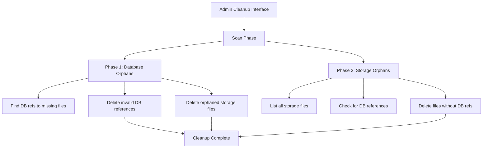

# Enhanced Orphaned Images Cleanup System

## Overview

The Enhanced Orphaned Images Cleanup System is a comprehensive solution that handles both database orphans (Firestore references to non-existent storage files) and storage orphans (storage files with no database references). This two-phase approach ensures complete cleanup and optimal storage utilization.

## Architecture



## Key Features

### ✅ Two-Phase Cleanup
- **Phase 1**: Database → Storage orphans (DB references to missing files)
- **Phase 2**: Storage → Database orphans (storage files without DB references)

### ✅ Safety Mechanisms
- Files must be older than 7 days to be deleted as storage orphans
- Comprehensive verification before deletion
- Dry run mode for testing
- Error handling and logging
- Admin-only access control

### ✅ Performance Optimizations
- Batch processing capabilities
- Smart caching for verification results
- Parallel processing support
- Progress tracking

### ✅ Comprehensive Reporting
- Detailed cleanup statistics
- Storage space savings calculation
- Error reporting and handling
- Audit trail logging

## Implementation Details

### Core Files

1. **`src/lib/cleanup-orphaned-images.ts`** - Core cleanup logic
2. **`src/lib/actions.ts`** - Server actions for admin interface
3. **`src/app/(authenticated)/admin/cleanup/page.tsx`** - Admin UI
4. **`src/app/api/admin/cleanup-user/route.ts`** - Testing API endpoint
5. **`src/scripts/test-cleanup.ts`** - Test utilities

### Key Functions

#### Phase 1: Database Orphans Cleanup
```typescript
cleanupOrphanedImagesForUser(
  userId: string, 
  dryRun: boolean = true, 
  deleteStorageFiles: boolean = true
)
```

#### Phase 2: Storage Orphans Cleanup
```typescript
cleanupStorageOrphansForUser(
  userId: string, 
  dryRun: boolean = true, 
  minFileAge: number = 7 * 24 * 60 * 60 * 1000
)
```

#### System-wide Cleanup
```typescript
cleanupAllOrphanedImages(deleteStorageFiles: boolean = true)
```

## Usage

### Admin Interface

1. **Access**: Navigate to `/admin/cleanup` (admin@brandforge.ai only)
2. **Scan**: Click "Scan for Orphaned Images" to identify orphans
3. **Configure**: Toggle "Also delete actual storage files" option
4. **Cleanup**: Click "Clean Up Orphaned Images" to execute cleanup

### API Testing

```bash
# Test individual user cleanup
POST /api/admin/cleanup-user
{
  "userId": "user-id-here",
  "adminEmail": "admin@brandforge.ai",
  "dryRun": true,
  "deleteStorageFiles": true
}
```

### Programmatic Usage

```typescript
import { cleanupOrphanedImagesForUser, cleanupStorageOrphansForUser } from '@/lib/cleanup-orphaned-images';

// Phase 1: Clean database orphans
const phase1Result = await cleanupOrphanedImagesForUser(userId, false, true);

// Phase 2: Clean storage orphans
const phase2Result = await cleanupStorageOrphansForUser(userId, false);
```

## Safety Features

### File Age Protection
- Storage orphans must be older than 7 days (configurable)
- Prevents deletion of recently uploaded files
- Accounts for processing delays and temporary states

### Verification Layers
1. **Existence Check**: Verify file exists before attempting deletion
2. **Reference Check**: Confirm no database references exist
3. **Path Validation**: Only process files in user directories
4. **Error Handling**: Graceful handling of network/permission errors

### Dry Run Mode
- Test cleanup operations without making changes
- Preview what would be deleted
- Validate logic before execution

## Monitoring and Logging

### Console Logging
```
[Admin Cleanup Orphaned Images] Starting comprehensive system-wide cleanup...
[Admin Cleanup Orphaned Images] Storage file deletion: ENABLED
✓ Phase 1: Cleaned up 15 orphaned DB references for user john@example.com
✓ Phase 2: Cleaned up 8 orphaned storage files for user john@example.com
✓ System-wide cleanup completed:
  - DB references deleted: 45
  - Storage files deleted (from DB orphans): 32
  - Storage orphans deleted: 18
  - Total storage space saved: 2.3 MB
```

### Error Tracking
- Individual file deletion errors are logged but don't stop the process
- Network timeouts are handled gracefully
- Permission errors are reported but don't crash the system

## Performance Considerations

### Batch Processing
- Users are processed sequentially to avoid overwhelming the system
- File operations are batched for efficiency
- Progress tracking for long-running operations

### Caching
- Verification results can be cached to avoid redundant checks
- File metadata is cached during processing
- Smart cache invalidation based on file age

### Resource Management
- Firebase Admin SDK connection pooling
- Memory-efficient file listing for large directories
- Configurable batch sizes for different environments

## Configuration Options

### Environment Variables
```env
# Firebase configuration (existing)
NEXT_PUBLIC_FIREBASE_STORAGE_BUCKET=your-bucket-name

# Cleanup configuration (optional)
CLEANUP_MIN_FILE_AGE_DAYS=7
CLEANUP_BATCH_SIZE=10
CLEANUP_ENABLE_CACHING=true
```

### Runtime Configuration
```typescript
// Minimum file age for storage orphan deletion (milliseconds)
const minFileAge = 7 * 24 * 60 * 60 * 1000; // 7 days

// Enable/disable storage file deletion
const deleteStorageFiles = true;

// Dry run mode
const dryRun = false;
```

## Testing

### Test Script
```bash
# Run comprehensive tests
npm run test:cleanup

# Or run directly
npx ts-node src/scripts/test-cleanup.ts
```

### Test Scenarios
1. **Clean User**: User with no orphaned images
2. **Heavy Orphan User**: User with many orphaned images
3. **Non-existent User**: Error handling for invalid user IDs
4. **Storage Orphans**: Files without database references
5. **Mixed Scenarios**: Combination of database and storage orphans

### API Testing
```bash
# Test with curl
curl -X POST http://localhost:3000/api/admin/cleanup-user \
  -H "Content-Type: application/json" \
  -d '{
    "userId": "test-user-id",
    "adminEmail": "admin@brandforge.ai",
    "dryRun": true,
    "deleteStorageFiles": true
  }'
```

## Migration from Old System

### Backward Compatibility
- Old cleanup functions still work but are deprecated
- Gradual migration path available
- No breaking changes to existing admin interface

### Migration Steps
1. **Phase 1**: Deploy enhanced system with storage deletion disabled
2. **Phase 2**: Test thoroughly in dry run mode
3. **Phase 3**: Enable storage deletion for comprehensive cleanup
4. **Phase 4**: Remove deprecated functions (optional)

## Troubleshooting

### Common Issues

#### Permission Errors
```
Error: Permission denied accessing storage file
```
**Solution**: Ensure Firebase Admin SDK has proper storage permissions

#### Network Timeouts
```
Error: Request timeout while checking file existence
```
**Solution**: Files are assumed to exist on timeout (safe default)

#### Large File Counts
```
Warning: Processing 10,000+ files may take significant time
```
**Solution**: Use batch processing and consider running during off-peak hours

### Debug Mode
Enable detailed logging by setting:
```typescript
console.log('[DEBUG] Detailed operation logs...');
```

## Best Practices

### Scheduling
- Run cleanup during off-peak hours
- Use automated scheduling for regular maintenance
- Monitor cleanup frequency based on orphan creation rate

### Monitoring
- Track storage space savings over time
- Monitor error rates and investigate patterns
- Set up alerts for unusual orphan counts

### Backup Strategy
- Consider backing up files before deletion (optional feature)
- Maintain audit logs for compliance
- Test restore procedures regularly

## Future Enhancements

### Planned Features
- [ ] Automated scheduling with cron-like syntax
- [ ] Backup integration before deletion
- [ ] Advanced analytics and trending
- [ ] Multi-admin approval for large cleanups
- [ ] Integration with monitoring systems
- [ ] Rollback capabilities for recent cleanups

### Performance Improvements
- [ ] Parallel user processing
- [ ] Smart batching based on system load
- [ ] Incremental cleanup (only recent changes)
- [ ] Predictive orphan detection

## Support

### Documentation
- This README for comprehensive overview
- Inline code comments for implementation details
- API documentation for testing endpoints

### Monitoring
- Console logs for operation tracking
- Error reporting for issue identification
- Performance metrics for optimization

### Maintenance
- Regular testing with provided test scripts
- Monitoring of cleanup effectiveness
- Performance optimization based on usage patterns

---

## Summary

The Enhanced Orphaned Images Cleanup System provides a robust, safe, and comprehensive solution for managing orphaned images in both directions. With its two-phase approach, extensive safety mechanisms, and detailed reporting, it ensures optimal storage utilization while maintaining data integrity and system performance.

**Key Benefits:**
- 🧹 Complete cleanup of both database and storage orphans
- 💰 Significant storage cost savings
- 🛡️ Multiple safety layers and verification
- 📊 Comprehensive reporting and monitoring
- 🔧 Easy testing and maintenance tools
- ⚡ Performance optimized for large-scale operations