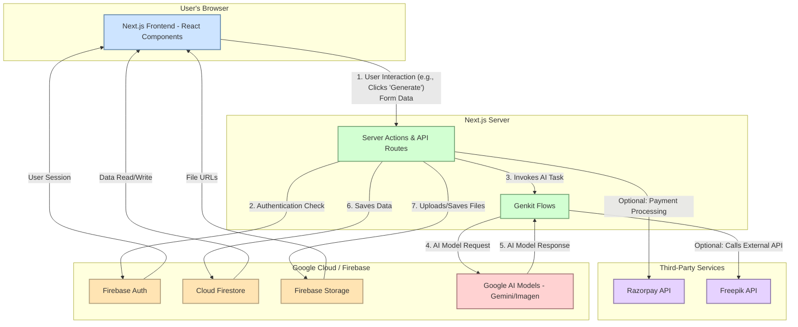

# BrandForge AI - High-Level Design

This document provides a visual representation of the BrandForge AI application's architecture. For a more detailed technical breakdown, please refer to the [Technical Blueprint](./BLUEPRINT.md).

## Architecture Diagram

The diagram below illustrates the main components of the system and the flow of data and requests between them.

### Component Descriptions

1.  **Next.js Frontend:** The user interface built with React. It handles all user interactions and communicates with the backend via Server Actions.
2.  **Server Actions & API Routes:** The primary backend logic layer within the Next.js server. It handles business logic, database operations, and calls to AI flows.
3.  **Genkit Flows:** A structured layer that manages all interactions with AI models. It defines prompts, validates inputs/outputs, and orchestrates calls to services like Google AI and Freepik.
4.  **Firebase Auth:** Handles all user authentication and session management.
5.  **Cloud Firestore:** The main NoSQL database for storing all user-specific data, brand profiles, and generated content metadata.
6.  **Firebase Storage:** Used for storing binary files like user-uploaded images and AI-generated logos.
7.  **Google AI Models:** The core generative AI engine (Gemini for text/vision, Imagen for images) that creates the content.
8.  **Third-Party Services:** External APIs like Razorpay for payment processing and Freepik for premium image generation.

### Typical Data Flow (Content Generation)

1.  A user in the **Frontend** fills out a form and clicks a "Generate" button.
2.  This triggers a **Server Action**, sending the form data to the server.
3.  The Server Action validates the request and invokes the appropriate **Genkit Flow**.
4.  The Genkit Flow sends a structured prompt to the **Google AI Models**.
5.  The AI Model returns the generated content (text or image data) to the Genkit Flow.
6.  The Genkit Flow returns the structured data to the Server Action.
7.  The Server Action saves the result to **Cloud Firestore** and/or **Firebase Storage**.
8.  The Server Action returns a success or error message to the **Frontend**, which then updates the UI to display the new content.